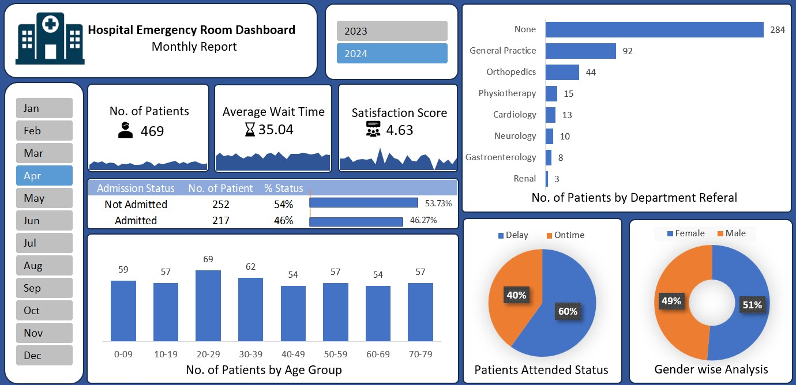

# Hospital Emergency Room Dashboard

## Overview
This project is a Microsoft Excel dashboard that provides insights into hospital emergency room operations. The dashboard visualizes key metrics, trends, and performance indicators to help healthcare professionals monitor and optimize emergency room efficiency.

## Dataset
The dataset used in this dashboard contains data related to emergency room visits, patient demographics, wait times, treatment durations, and discharge outcomes. It includes the following key attributes:
- **Patient ID**: Unique identifier for each patient visit.
- **Age**: Age of the patient.
- **Gender**: Gender of the patient.
- **Visit Date**: Date of the emergency room visit.
- **Arrival Mode**: How the patient arrived at the emergency room (e.g., ambulance, walk-in, etc.).
- **Wait Time (Minutes)**: Time taken before the patient sees a healthcare provider.
- **Treatment Duration (Minutes)**: Time spent in the emergency room receiving treatment.
- **Diagnosis**: Medical condition diagnosed.
- **Discharge Status**: Outcome of the visit (e.g., admitted, discharged, referred).

**Dataset Link:** [Hospital Emergency Dataset](https://www.kaggle.com/datasets/xavierberge/hospital-emergency-dataset)

## Dashboard Features
The Microsoft Excel dashboard includes the following components:
- **Key Performance Indicators (KPIs)**: Displays metrics like average wait time, treatment duration, and total ER visits.
- **Trends Over Time**: Line charts showing variations in patient visits, wait times, and discharge rates over time.
- **Demographic Analysis**: Visual breakdown of patient age groups, gender distribution, and visit frequencies.
- **Arrival Mode Analysis**: Highlights how patients are arriving at the ER.
- **Diagnosis & Outcomes**: Displays the most common diagnoses and their corresponding discharge statuses.

## Screenshot

## How to Use
1. Open the Excel file containing the dashboard.
2. Ensure the dataset is properly loaded.
3. Interact with the visuals to explore different aspects of emergency room operations.

## Installation
To view and interact with the dashboard, you need:
- Microsoft Excel (2016 or later recommended)
- The dataset file (`HospitalEmergencyRoomDashboard.xlsx`)

## Contributing
Contributions are welcome! Feel free to submit issues or pull requests to improve the dashboard.

## License
This project is licensed under the MIT License.
